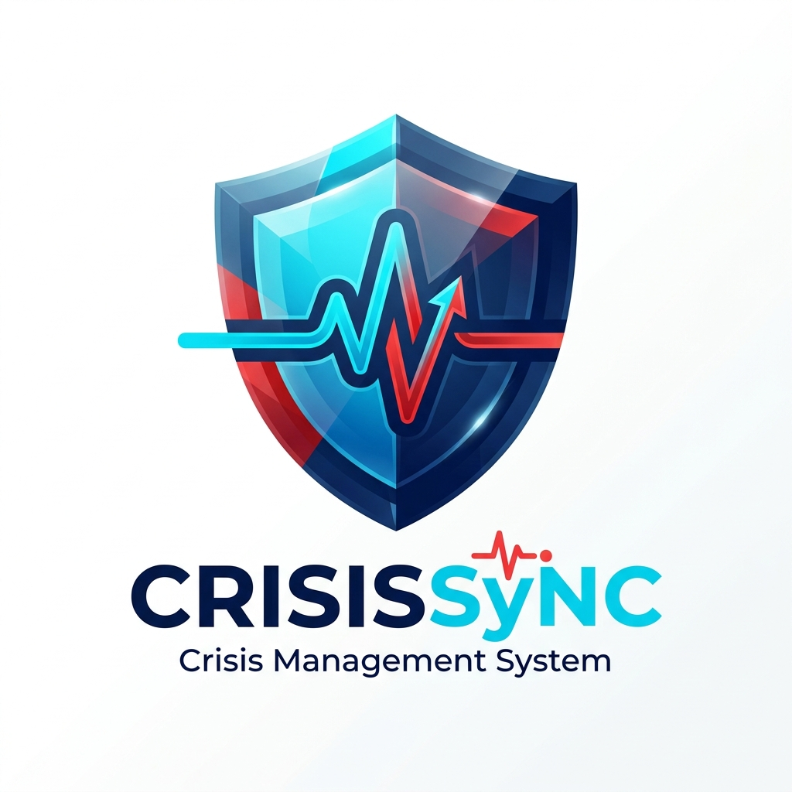

<p align="center">
  
</p>

# 🛡️ CrisisSync: Advanced Management & Coordination

**CrisisSync** is a high-performance, real-time crisis coordination platform designed to unify emergency response efforts. Built with **React**, **Firebase**, and **Google Gemini AI**, it provides a mission-critical interface for administrators and field staff to manage incidents with surgical precision.

---

## ⚡ Core Capabilities

### 🧠 AI-Powered Intelligence (Gemini AI)
*   **Instant Triage**: Automated classification of incident type and priority (Critical, High, Medium, Low).
*   **Tactical Briefing**: Generates structured **EMS Incident Briefs** covering Situation, Hazards, Access, and Patients.
*   **Dynamic Recommendations**: AI-driven action plans based on available staff and incident severity.
*   **Natural Language Processing**: Transforms raw guest reports into structured, actionable data.

### 🗼 Live Command Center (Admin)
*   **Visual Oversight**: Real-time incident list with priority tagging and severity heatmaps.
*   **Resource Allocation**: Drag-and-drop task assignment to live-tracked staff units.
*   **Global Timeline**: Chronological log of all system events and incident status shifts.
*   **Tactical Map**: Visual representation of crisis zones and unit deployment.

### 📱 Field Response Portal (Staff)
*   **Real-time Alerts**: Instant notification of new assignments with acknowledge/resolve flows.
*   **Status Sync**: Immediate backend synchronization of field actions.

---

## 🚀 Technology Stack

*   **Logic**: [React 18](https://react.dev/) + [Vite](https://vitejs.dev/)
*   **Backend**: [Firebase](https://firebase.google.com/) (Realtime Database, Authentication)
*   **Intelligence**: [Google Gemini Pro / Flash](https://aistudio.google.com/)
*   **Aesthetics**: Glassmorphism, Fluid Layouts, [Lucide React Icons](https://lucide.dev/)

---

## 🛠️ Installation & Setup

### 1. Environment Configuration
Create a `.env` file in the root directory. This is **required** for the system to initialize secure connections.

```env
VITE_FIREBASE_API_KEY=your_key
VITE_FIREBASE_AUTH_DOMAIN=your_domain
VITE_FIREBASE_PROJECT_ID=your_id
VITE_FIREBASE_DATABASE_URL=your_db_url
VITE_FIREBASE_STORAGE_BUCKET=your_bucket
VITE_FIREBASE_MESSAGING_SENDER_ID=your_sender_id
VITE_FIREBASE_APP_ID=your_app_id
VITE_FIREBASE_FUNCTIONS_REGION=us-central1
VITE_GEMINI_API_KEY=your_gemini_key
```

Set the Gemini secret on the backend instead of shipping it to the browser:

```bash
firebase functions:secrets:set GEMINI_API_KEY
```

### 2. Local Launch
```bash
# Install dependencies
npm install

# Start development server
npm run dev
```

---

## 🛡️ Access & Security Protocol

> [!IMPORTANT]
> **Credential & System Access Policy**
> To maintain the integrity of the crisis network, access to internal systems is strictly controlled:
> 
> 1.  **Restricted API Keys**: Firebase config is public-client safe, while the Gemini key is stored in Firebase Functions secrets and used only from backend callable functions.
> 2.  **Role-Based Access Control (RBAC)**: The Command Center and Resource Deployment panels are unreachable without an authenticated Admin session.
> 3.  **Encrypted Environment**: All sensitive configuration is handled via server-side environment variables or secure local `.env` files which are excluded from version control.
> 4.  **Verification Flow**: New registrations require a 6-digit verification code to ensure identity validation before portal access is provisional.

---

## 📖 Operational Workflow

1.  **Detection**: An incident is reported by a guest or detected by the system.
2.  **Analysis**: Gemini AI immediately triages the report, setting a 1-10 severity scale.
3.  **Response**: An Administrator reviews the AI Brief and assigns the "Critical" task to the nearest available Staff member.
4.  **Resolution**: Field Staff acknowledges and eventually resolves the incident, archiving the data for post-crisis reporting.

---

## 🚀 Deployment Notes

```bash
npm ci
npm run build
firebase use <your-project-id>
firebase deploy
```

- Hosting serves the built Vite app from `dist/`.
- Realtime Database rules are in `database.rules.json`.
- Firebase Functions source is in `functions/`.
- `functions/` requires its own `npm install` before local emulator or deploy verification.

---
*Developed for the Google Hackathon 2024. Empowering the frontlines of emergency response.*
